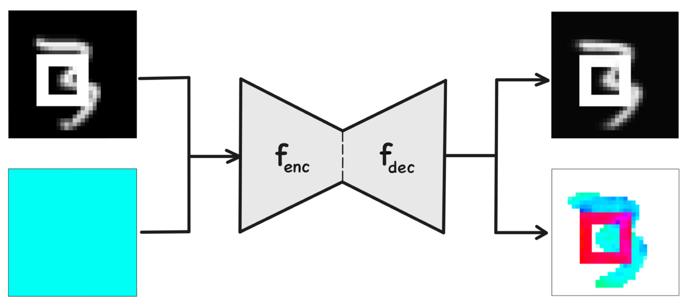

# Complex-Valued AutoEncoders for Object Discovery

We present the Complex AutoEncoder – an object discovery approach that takes inspiration from neuroscience to implement distributed object-centric representations. 
After introducing complex-valued activations into a convolutional autoencoder, it learns to encode feature information in the activations’ magnitudes and object affiliation in their phase values.

This repo provides a reference implementation for the Complex AutoEncoder (CAE) as introduced in our paper "Complex-Valued AutoEncoders for Object Discovery" ([https://arxiv.org/abs/2204.02075](https://arxiv.org/abs/2204.02075)) by Sindy Löwe, Phillip Lippe, Maja Rudolph and Max Welling.




## Setup

Make sure you have conda installed (you can find instructions [here](https://www.anaconda.com/products/distribution)). 

Then, run ```bash setup.sh``` to download the 2Shapes, 3Shapes and MNIST&Shapes datasets and to create a conda environment with all required packages.

The script installs PyTorch with CUDA 11.3, which is the version we used for our experiments. If you want to use a different version, you can change the version number in the ```setup.sh``` script.


## Run Experiments

To train and test the CAE, run one of the following commands, depending on the dataset you want to use:

```python -m codebase.main +experiment=CAE_2Shapes```

```python -m codebase.main +experiment=CAE_3Shapes```

```python -m codebase.main +experiment=CAE_MNISTShapes```


## Citation
When using this code, please cite our paper:

```
@article{lowe2022complex,
  title={Complex-Valued Autoencoders for Object Discovery},
  author={L{\"o}we, Sindy and Lippe, Phillip and Rudolph, Maja and Welling, Max},
  journal={Transactions on Machine Learning Research (TMLR)},
  year={2022}
}
```

## Contact
For questions and suggestions, feel free to open an issue on GitHub or send an email to [loewe.sindy@gmail.com](mailto:loewe.sindy@gmail.com).
